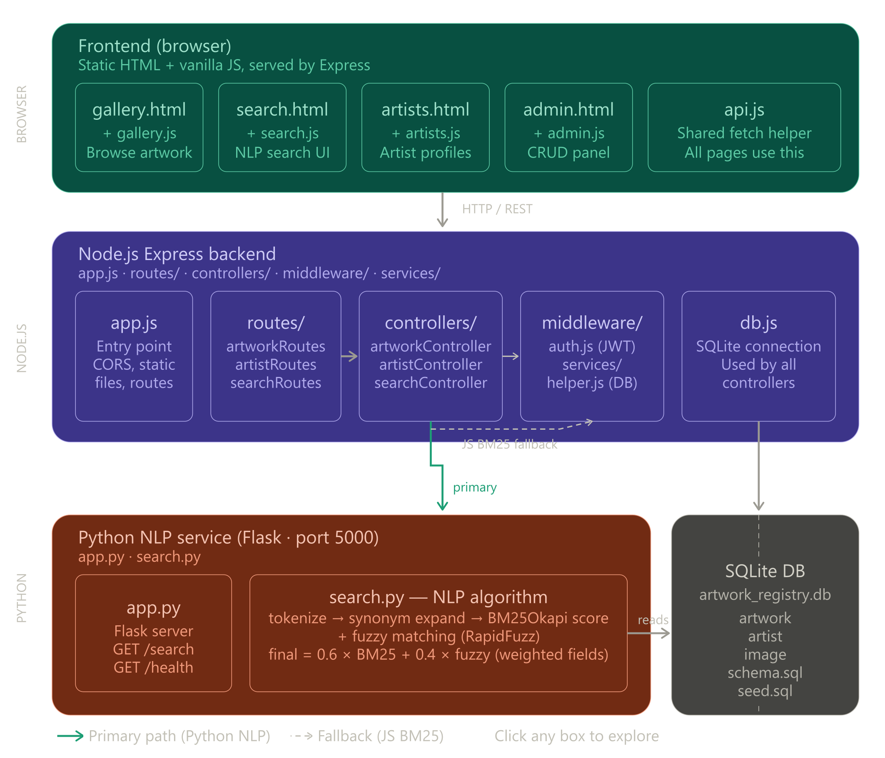

# Saint Martin's Abbey — Artwork Registry




## Setup

### 1. Database
```bash
mysql -u root -p < database/schema.sql
mysql -u root -p < database/seed.sql
```

### 2. .env file
Fill in your MySQL password in `.env`

### 3. Node.js backend
```bash
npm install
node backend/app.js
# opens http://localhost:3000
```

### 4. Python NLP service (optional but recommended)
```bash
cd nlp-service
pip install -r requirements.txt
python app.py
# opens http://localhost:5000
```
If Python service is offline, search automatically falls back to SQL keywords.

## NLP Search Engine

### How it works:
1. User types: `"evening prayer painting"`
2. Clean: remove symbols → lowercase → `["evening","prayer","painting"]`
3. Remove stop words (`the`, `by`, `a`) → `["evening","prayer","painting"]`
4. Score each artwork:
   - Title match      → **+3 points**
   - Artist match     → **+2 points**
   - Medium match     → **+2 points**
   - Description match → **+1 point**
5. Sort by total score → highest first
6. Return top 20

### Limitations (mention these in your report):
- No synonym detection ("art" ≠ "painting")
- No deep semantic understanding
- Simple word matching, not embedding-based
- Future: TF-IDF weighting, BERT embeddings

## API Endpoints
| Method | URL | What it does |
|--------|-----|-------------|
| GET | `/api/artworks` | All artworks (admin) |
| GET | `/api/artworks/published` | Public gallery only |
| GET | `/api/artworks/:id` | Full artwork detail |
| POST | `/api/artworks` | Create artwork |
| PATCH | `/api/artworks/:id/publish` | Toggle publish |
| DELETE | `/api/artworks/:id` | Delete artwork |
| POST | `/api/artworks/:id/image` | Upload image |
| GET | `/api/artists` | All artists |
| POST | `/api/artists` | Create artist |
| GET | `/api/search?q=...` | NLP/keyword search |
